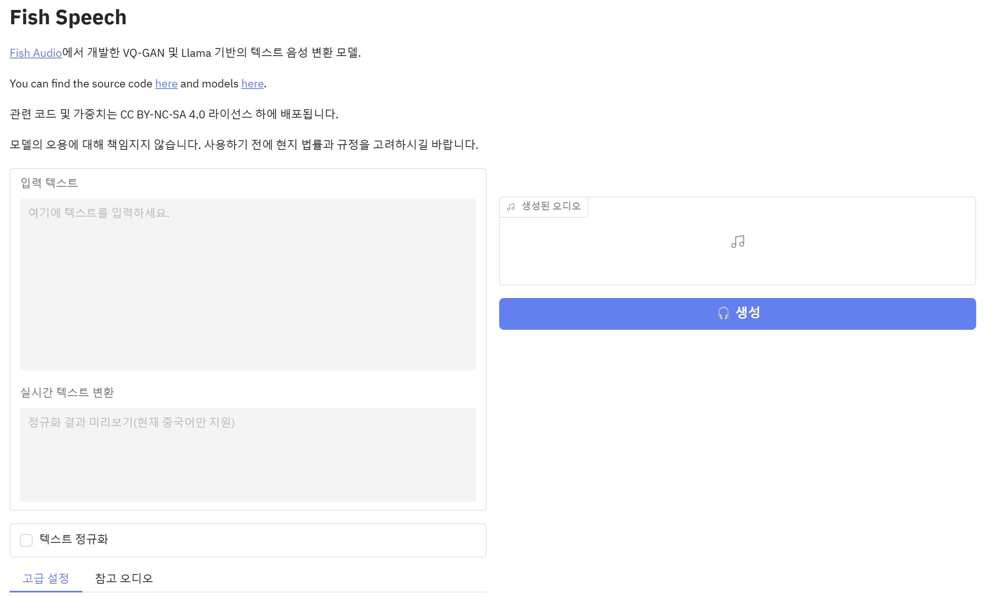
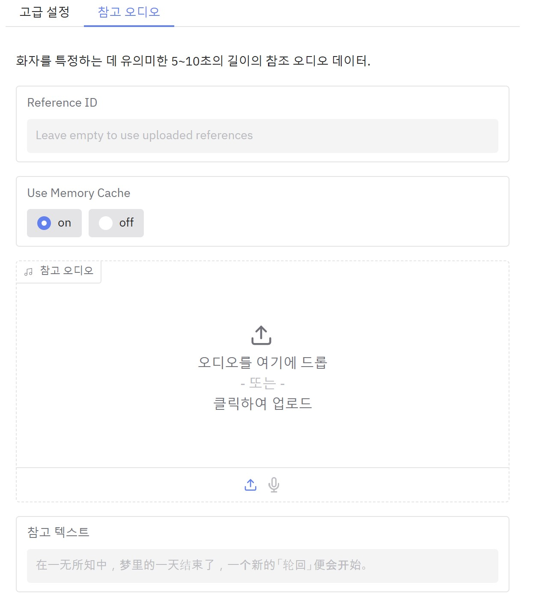
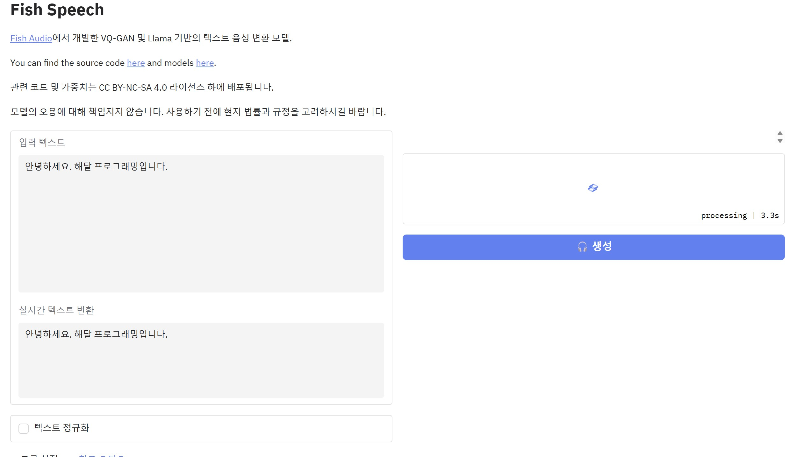
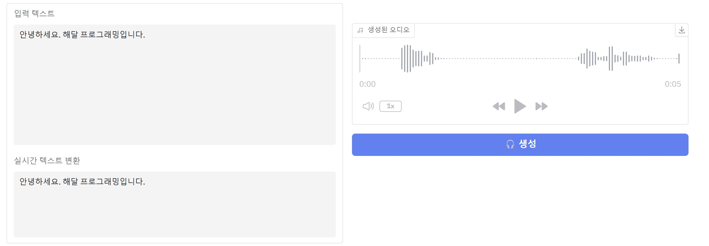

# customTTS
오픈소스로 만드는 커스텀 TTS


## Installation on Windows

1. Open Source TTS 다운로드
     - [fish-speech](https://github.com/fishaudio/fish-speech) -> Code -> Dounload Zip<br/>
     - unzip files
2. Double click **install_env.bat**
     - install miniconda, create virtual env, install packages
3. If you want to enable compilation acceleration:
      1. Download and install the [LLVM compiler-17.0.6](https://huggingface.co/fishaudio/fish-speech-1/resolve/main/LLVM-17.0.6-win64.exe?download=true)
         -  check the `Add Path to Current User`<br/>
      2. Download and install the Microsoft Visual C++ Redistributable [MSVC++ 14.40.33810.0 Download](https://aka.ms/vs/17/release/vc_redist.x64.exe)
      3. Download and install Visual Studio Community Edition to get MSVC++ build tools
         - [Visual Studio Download](https://visualstudio.microsoft.com/ko/downloads/)
         - After installing Visual Studio Installer, download `Visual Studio Community 2022`.
         - As shown below, click the `Modify` button and find the `Desktop development with C++` option to select and download.<br/>
      4. Download and install [CUDA Toolkit 12.1](https://developer.nvidia.com/cuda-12-1-0-download-archive?target_os=Windows&target_arch=x86_64)<br/>


## Inference using Web UI

1. Open `fish-speech-main` folder
2. Download [checkpoints](https://drive.google.com/drive/folders/1Vly8ZPh_e4SuPxEjv3c3xFodp6uHIWR3?usp=drive_link) to `checkpoints` folder
3. Open terminal on `fish-speech-main` folder
4. run
    ```bash
    fishenv\env\python.exe -m tools.run_webui  --llama-checkpoint-path "checkpoints/fish-speech-1.5-250227-lora"  --decoder-checkpoint-path "checkpoints/fish-speech-1.5/firefly-gan-vq-fsq-8x1024-21hz-generator.pth"  --decoder-config-name firefly_gan_vq --compile
    ```
5. When the `* Running on local URL:  http://127.0.0.1:xxxx` log appears, you're ready. Go to that address using a web browser.<br/>
6. There are settings at the bottom of the screen.<br/><br/>
7. Upload or record reference audio to determine the voice you want to imitate.
8. Enter the text you want to generate on the left and press the Generate button.<br/>
9. Check the generated voice and if the quality is too low, press the Generate again button.<br/>


## Troubleshooting

 - If you installed following step 3 but still cannot use the GPU, run the following command.
    ```bash
    fishenv\env\python.exe -m pip install torch==2.4.1 torchvision==0.19.1 torchaudio==2.4.1 --index-url https://download.pytorch.org/whl/cu121
    ```

## References
 - [Fish-speech document](https://speech.fish.audio/)